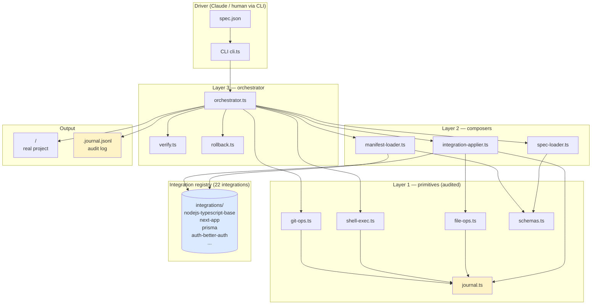
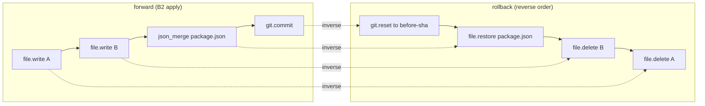
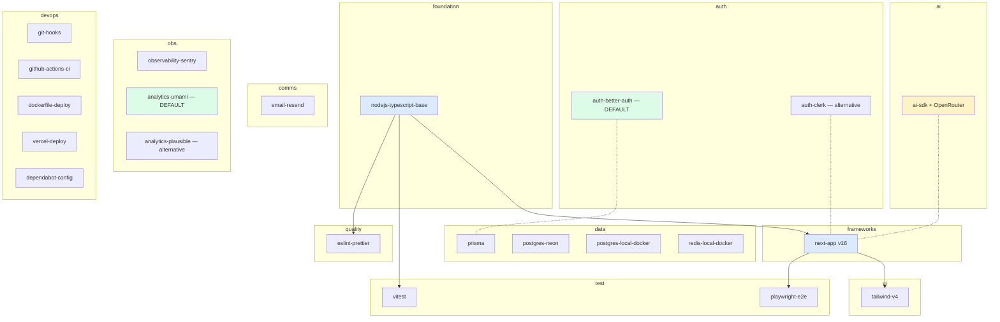

# How the Bootstrap Scaffold Works

> Written 2026-05-08 after Day 6. Lives at
> `~/.claude/plugins/marketplaces/local/plugins/dev-pipeline/bootstrap/`.

## What it produces

Given a JSON spec like:

```json
{
 "meta": { "name": "my-app", "description": "...", "spec_schema_version": 1 },
 "integrations": [
 { "name": "next-app", "category": "observability", "version": "16.0.0" },
 { "name": "auth-better-auth", "category": "auth", "version": "1.0.0" },
 { "name": "prisma", "category": "database", "version": "1.0.0" },
 { "name": "postgres-neon", "category": "database", "version": "1.0.0" }
 ]
}
```

…produce a fully-working project under `<out-dir>` with:

- All package files written + JSON-merged
- `pnpm install` run (optionally)
- `prisma generate` (or any other `postinstall`) auto-fired by npm lifecycle
- Git repo initialised + first commit
- A complete audit journal at `<out-dir>.journal.jsonl` so any step is **reversible**

One CLI call, no hand-coded steps.

---

## Architecture (3 layers + integration registry)



### Why 3 layers

| Layer | Files | Responsibility | Anyone above can fail safely because… |
|---|---|---|---|
| **1 — primitives** | `errors.ts`, `schemas.ts`, `journal.ts`, `file-ops.ts`, `shell-exec.ts`, `git-ops.ts`, `manifest-validator.ts` | Idempotent, audited, reversible operations on the file system / git / shell | Every mutation emits an `inverse` action to the journal; rollback replays them in reverse |
| **2 — composers** | `spec-loader.ts`, `manifest-loader.ts`, `integration-applier.ts` | Validate inputs, sort manifests in dep order, apply ONE manifest to a target tree | Layer 1 fails surface as typed `BootstrapError`; the applier never partially mutates without journal |
| **3 — orchestrator** | `orchestrator.ts`, `verify.ts`, `rollback.ts`, `cli.ts` | Drive the B0→B6 lifecycle, surface results, run verifications | Any phase failure leaves a journal that `cli rollback` can replay |

The layers are **strictly downward-only**: Layer 1 never imports Layer 2; Layer 2 never imports Layer 3. This is the only architecture rule.

---

## Lifecycle: B0 → B6

```mermaid
sequenceDiagram
 autonumber
 participant U as Human / Claude
 participant CLI as cli.ts
 participant O as orchestrator
 participant SL as spec-loader
 participant ML as manifest-loader
 participant IA as applier
 participant FS as filesystem + git
 participant J as journal.jsonl

 U->>CLI: scaffold spec.json out-dir --install
 CLI->>O: orchestrate(opts)

 Note over O: B0 — parse spec
 O->>SL: loadSpec(specPath)
 SL->>FS: read + JSON.parse + Zod validate
 SL-->>O: ProjectSpec
 O->>J: record('spec.parsed')

 Note over O: B1 — resolve manifests (topo-sort by deps)
 O->>ML: loadAndOrder(registry, names)
 ML->>FS: read each integration dir + validate
 ML->>ML: assertSetValid + topoSort
 ML-->>O: LoadedIntegration[]
 O->>J: record('integrations.resolved')

 Note over O: B2 — apply each integration in dep order
 loop for each integration
 O->>IA: applyIntegration(ctx, integration)
 IA->>FS: copy patch/* (with placeholder substitution)
 IA->>FS: deep-merge json_merges (incl. $delete sentinel)
 IA->>FS: upsertFenced files_appended
 IA->>FS: append env.template / dev-defaults.env
 IA->>J: record('integration.applied')
 end

 Note over O: B3 — git init + commit
 O->>FS: git init -b main; git add .; git commit
 O->>J: record('git.commit', inverse: shell.exec("git update-ref -d HEAD"))

 alt --install flag set
 Note over O: B4 — pnpm install (npm postinstall lifecycle handles codegen)
 O->>FS: pnpm install (frozen-lockfile NOT used: fresh repo)
 Note right of FS: postinstall: prisma generate fires automatically
 O->>J: record('install.ok')
 end

 alt --verify flag set
 Note over O: B5 — verify each integration
 loop for each integration
 O->>FS: shell-exec verification.dev cmd
 O->>J: record('verify.pass' or 'verify.fail')
 end
 end

 Note over O: B6 — finalize + return result
 O->>J: record('bootstrap.complete')
 O-->>CLI: { ok, outDir, journalPath, integrations[], … }
 CLI-->>U: stdout summary + @@RESULT@@ JSON line
```

---

## Anatomy of one integration

```
integrations/<name>/
├── manifest.json # Zod-validated IntegrationManifest
├── patch/ # files COPIED verbatim into target (verbatim = files_owned)
│ └── ...
├── merge/ # JSON files DEEP-MERGED into existing target files
│ └── package.json # → merged into target's package.json
├── fence/ # text bodies APPENDED into existing target files via fence markers
│ └── <safe-fence-id>.txt
├── env.template # appended into target's .env.example (under @<name>/env fence)
└── dev-defaults.env # appended into target's .env.local (under @<name>/dev fence)
```

### How an integration touches the target tree

```mermaid
graph LR
 subgraph "integrations/prisma/"
 M[manifest.json<br/>files_owned: [prisma/schema.prisma, src/lib/db.ts]<br/>json_merges: [package.json]]
 P[patch/prisma/schema.prisma]
 P2[patch/src/lib/db.ts]
 MJ[merge/package.json<br/>scripts.postinstall: prisma generate<br/>scripts.db:migrate: ...<br/>devDeps.prisma: ^6]
 end

 subgraph "produced project"
 T1[prisma/schema.prisma]
 T2[src/lib/db.ts]
 T3[package.json<br/>existing scripts + new ones merged in]
 end

 P -->|copy| T1
 P2 -->|copy| T2
 MJ -.->|deep-merge| T3
```

### Three operations an integration can perform on shared files

| Operation | Use when… | How conflicts are resolved |
|---|---|---|
| **`files_owned`** (verbatim copy) | Only one integration ever writes this file | First wins; multiple owners → `INTEGRATION_CONFLICT` at validate time |
| **`json_merges`** (deep-merge) | Multiple integrations contribute scripts/deps to `package.json` etc. | All merges run in dep order; later wins on scalar conflict; `"$delete"` sentinel removes a base key |
| **`files_appended`** (fence-marker upsert) | Multiple integrations contribute lines to an `.env` / config file | Each integration's body lives between `=== @<id> ===` markers; re-applying replaces only that section |

---

## Reversibility — the journal

Every side-effecting operation in Layer 1 emits a `BootstrapJournalEntry` to `<out-dir>.journal.jsonl`:

```json
{"ts":"2026-05-08T00:30:00Z","run_id":"…","phase":"B2","event":"file.write","outcome":"ok",
 "data":{"path":"package.json","sha256":"abc…","bytes":1242},
 "inverse":{"event":"file.delete","path":"package.json"}}
```

`cli rollback <journal>` replays inverse actions **in reverse order**, so a partial failure leaves the target tree restorable to a clean state.



---

## Integration registry (22 integrations)



**Free-tier defaults** (the `examples/spec-production.json` preset):
- Auth = better-auth (no MAU cap)
- Analytics = Umami (10k events/mo free hosted)
- DB = postgres-neon (0.5GB free)
- Errors = Sentry (5k events/mo free)
- Email = Resend (3k/mo free)
- AI = ai-sdk + OpenRouter free models (Llama 3.1, Mistral 7B, Gemma)
- CI = GitHub Actions (free for public; generous private)
- Hosting = Vercel (Hobby tier free) or self-host via dockerfile-deploy

---

## CLI surface

```
$ tsx cli.ts <command>

scaffold <spec.json> <out-dir> [--install] [--verify] [--registry <dir>]
 Run B0–B6. Produces a real project under <out-dir>.

validate <spec.json>
 Run B0 only. Exits 0 on valid, 2 on invalid. Result on stderr as @@RESULT@@.

list-integrations [registry-dir]
 Print every integration in the registry with category/version/description.

inspect <project-dir>
 Read <project-dir>.journal.jsonl and print every event.

verify <project-dir>
 Re-run each integration's verification.dev in <project-dir>.

rollback <journal.jsonl> [--dry-run]
 Replay inverse actions in reverse order. --dry-run reports the plan.
```

Every command emits a single `@@RESULT@@ {…}` JSON line on stderr — easy for an LLM agent to parse.

---

## Test surface (139 tests, 6 days)

```
layer1/__tests__/ — primitives (69 tests)
 errors / schemas / journal / file-ops / shell-exec / git-ops / manifest-validator
layer2/__tests__/ — composers (32 tests)
 spec-loader / manifest-loader / integration-applier (incl. json_merges + $delete + placeholders)
__tests__/cli.test.ts — CLI subprocess tests (9 tests)
__tests__/landmines.test.ts — REGRESSION ASSERTIONS for every real-world landmine (29 tests)
```

The **landmine** suite is the immune system. Every time we hit a bug
we'd hit before, it gets a test there. Examples:

- `dockerfile-deploy COPY prisma comes before RUN pnpm install`
- `pre-push has SUBSTANTIVE_RE / MECHANICAL_RE detection`
- `vitest sample uses vi.stubEnv("TZ", …) under multiple zones`
- `playwright-e2e is headed-by-default`
- `Github Actions ${{ }} is NOT mistaken for a scaffold placeholder` (placeholder-substitution false positive)

---

## What it does NOT do

- Code generation from a PRD — the spec-loader takes a structured JSON spec, not English. Pre-spec parsing happens in the dev-pipeline plugin's `requirements-analyst` agent.
- App-domain logic — multi-tenancy, booking concurrency, business rules. Those belong in the user's app code, not the scaffold.
- Generic CRUD scaffolding — the registry doesn't ship `users` or `posts` models. Add them after scaffold.

---

## Where to read code

| If you want to understand… | Start at |
|---|---|
| The shape of a spec | `layer1/schemas.ts` (`ProjectSpec`) |
| What an integration is | `layer1/schemas.ts` (`IntegrationManifest`) + `integrations/nodejs-typescript-base/manifest.json` |
| How files are written | `layer1/file-ops.ts` (`writeFile`, `upsertFenced`) |
| How the lifecycle works | `layer3/orchestrator.ts` (B0–B6 sequence) |
| How rollback works | `layer1/journal.ts` (`replay`, `inversePlan`) |
| What landmines are pre-empted | `LEARNINGS_APPLIED.md` + `__tests__/landmines.test.ts` |
| How to add a new integration | `PREFLIGHT_CHECKLIST.md` + copy any existing integration as template |
